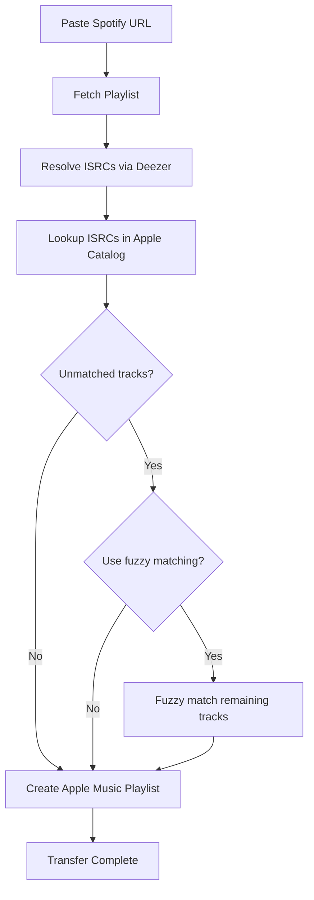

<p align="center">
  
</p>

<p align="center">
  <a href="LICENSE"></a>
  
</p>

A .NET 10 CLI tool to transfer Spotify playlists to Apple Music without any developer accounts required

## Features

- Interactive modern CLI built with Spectre.Console
- Spotify playlist import from standard URLs, embed URLs, intl URLs, and `spotify:` URIs
- Two-stage matching pipeline:
  - ISRC-based matching (resolved via the Deezer catalog, since Spotify does not expose ISRCs publicly)
  - Optional fuzzy matching for remaining tracks
- Automatic Apple Music playlist creation and batched track insertion
- Token caching to avoid reauthentication

## Requirements

- .NET SDK 10.0+
- Apple Music account

## How It Works

Ciderfy fetches Spotify playlists without requiring an API key by using the web player's internal GraphQL endpoint with TOTP-based authentication

An Apple Music developer token is automatically extracted from the web player's JavaScript bundles, removing the need for a $99/year Apple Developer account

ISRCs (International Standard Recording Codes) are then resolved through the Deezer catalog and used to find exact matches in the Apple Music catalog

Tracks that weren't matched can then go through an optional fuzzy matching pass that compares titles and artists using Jaro-Winkler string similarity

### Transfer Flow



## Quick Start

```bash
dotnet restore
dotnet run --project src/Ciderfy
```

Or with Make targets:

```bash
make build
make run
```

## First-Time Authentication

In the app, run:

```text
/auth
```

Then follow the prompt:

1. Open `https://music.apple.com` in your browser and sign in
2. Open your browser's DevTools Console
3. Run:

   ```js
   MusicKit.getInstance().musicUserToken;
   ```

4. Paste the returned token into Ciderfy, it will then be cached

Ciderfy will also automatically fetch and cache a valid Apple Music developer token if it isn't already in cache

## Usage

After startup, paste a Spotify playlist URL, for example:

```text
https://open.spotify.com/playlist/<playlist-id>
```

You can set storefront and playlist naming behavior before transfer using commands below

## Commands

- `/auth` - authenticate with Apple Music
- `/auth reset` - clear cached tokens and re-authenticate
- `/status` - show tokens and storefront status
- `/storefront <code>` or `/sf <code>` - set Apple Music storefront (default: `us`)
- `/name <name>` - set name override for the next created playlist
- `/name` - clear name override
- `/help` or `/h` - show command help
- `/quit`, `/exit`, or `/q` - exit

## Notes and Limitations

- Tokens are cached locally in your application data directory under `Ciderfy/tokens.json`
- This project relies on third-party services and API behavior that may change
- Spotify playlist fetch currently allows up to 1000 tracks per call
- Apple Music developer token extraction is based on current web player assets

## License

MIT. See `LICENSE`.
