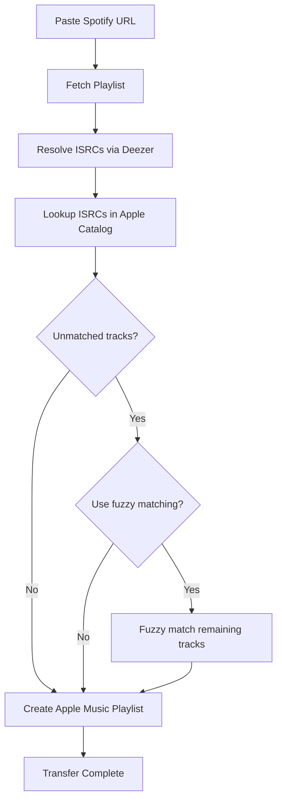

<p align="center">
  
</p>

<p align="center">
  <a href="https://github.com/thomas-fazzari/ciderfy/actions/workflows/ci.yml"></a>
  <a href="https://codecov.io/gh/thomas-fazzari/ciderfy"></a>
  <a href="LICENSE"></a>
  
</p>

A .NET 10 TUI tool to transfer Spotify playlists to Apple Music without any developer accounts required

## Features

- Interactive modern TUI app built with Spectre.Console
- Spotify playlist import from standard URLs, embed URLs, intl URLs, and `spotify:` URIs
- Playlist Merging: Queue multiple Spotify playlists with `/add <url>` and merge them into a single deduplicated Apple Music playlist with `/run`
- Two-stage matching pipeline:
  - ISRC-based matching (resolved via the Deezer catalog, since Spotify does not expose ISRCs publicly)
  - Optional fuzzy matching for remaining tracks
- Automatic Apple Music playlist creation and batched track insertion
- Token caching to avoid repeated authentication (user token cached for 6 months)

## Installation

### Homebrew (recommended)

```bash
brew tap thomas-fazzari/ciderfy
brew install ciderfy
```

### Requirements

- Apple Music account

## How It Works

Ciderfy fetches Spotify playlists without an API key via the web player's internal GraphQL endpoint with TOTP-based auth.

An Apple Music developer token is automatically extracted from the web player's JS bundles, no $99/year Apple Developer account needed.

ISRCs are resolved through the Deezer catalog (Spotify does not expose them publicly) by scoring candidates against the original title and artist, then used to find exact matches in the Apple Music catalog.

Tracks without an ISRC match can go through an optional fuzzy pass using Jaro-Winkler similarity, penalized by duration difference to reduce false positives.

### Transfer Flow


```mermaid
flowchart TD
    A[Paste Spotify URL] --> B[Fetch Playlist]
    B --> C[Resolve ISRCs via Deezer]
    C --> D[Lookup ISRCs in Apple Catalog]
    D --> E{Unmatched tracks?}

    E -- No --> H[Create Apple Music Playlist]
    E -- Yes --> F{Use fuzzy matching?}

    F -- No --> H
    F -- Yes --> G[Fuzzy match remaining tracks]
    G --> H

    H --> I[Transfer Complete]
```

## Quick Start

```bash
ciderfy
```

### From source

```bash
dotnet restore
dotnet run --project src/Ciderfy
```

## First-Time Authentication

In the app, run:

```text
/auth
```

Then follow the prompt:

1. Open `https://music.apple.com` in your browser and sign in
2. Open your browser's DevTools Console
3. Run:

   ```js
   MusicKit.getInstance().musicUserToken;
   ```

4. Paste the returned token into Ciderfy (cached for 6 months)

The tool will automatically fetch and cache a valid Apple Music developer token if needed.

## Usage

After startup, paste a Spotify playlist URL for a direct transfer:

```text
https://open.spotify.com/playlist/<playlist-id>
```

Or queue multiple playlists to merge them into one:

```text
/add https://open.spotify.com/playlist/<id-1>
/add https://open.spotify.com/playlist/<id-2>
/run
```

You can set storefront and playlist naming behavior before transfer using commands below.

## Commands

- `/auth` - authenticate with Apple Music
- `/auth reset` - clear cached tokens and re-authenticate
- `/status` - show tokens and storefront status
- `/storefront <code>` or `/sf <code>` - set Apple Music storefront (default: `us`)
- `/add <url>` - queue a Spotify playlist for merging
- `/run` - start the transfer and merge all queued playlists
- `/name <name>` - set name override for the next created playlist
- `/name` - clear name override
- `/help` or `/h` - show command help
- `/quit`, `/exit`, or `/q` - exit

## Notes and Limitations

- Tokens are cached locally in your application data directory under `Ciderfy/tokens.json`
- This project relies on third-party services and API behavior that may change
- Spotify playlist fetch currently allows up to 1000 tracks per call
- Apple Music developer token extraction is based on current web player assets

## License

MIT. See `LICENSE`.
