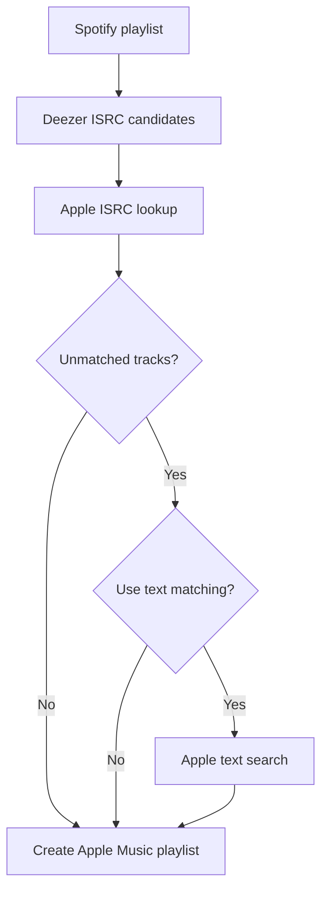

<p align="center">
  
</p>

<p align="center">
  <a href="https://github.com/thomas-fazzari/ciderfy/actions/workflows/ci.yml"></a>
  <a href="https://codecov.io/gh/thomas-fazzari/ciderfy"></a>
  <a href="LICENSE"></a>
  
</p>

A terminal app for transferring Spotify playlists to Apple Music without any developer accounts or API key required.

## What It Does

- Imports Spotify playlists from standard URLs, embed URLs, intl URLs, and `spotify:` URIs.
- Creates Apple Music playlists and adds matched tracks in batches.
- Merges several Spotify playlists into one deduplicated Apple Music playlist.
- Uses ISRC matching first, with optional text matching for leftovers.

## Setup

```bash
brew tap thomas-fazzari/ciderfy
brew install ciderfy
```

Launch the app:

```bash
ciderfy
```

### Authentication

Apple Music needs a user token to create playlists in your library.

Run this once before your first transfer:

```text
/auth
```

Then:

1. Open `https://music.apple.com` and sign in.
2. Open your browser's DevTools Console.
3. Run:

   ```js
   MusicKit.getInstance().musicUserToken;
   ```

4. Paste this value into the app. It will be cached for 6 months in Ciderfy's config folder.

## Usage

Paste one playlist:

```text
https://open.spotify.com/playlist/<playlist-id>
```

Or queue several playlists:

```text
/add https://open.spotify.com/playlist/<id-1>
/add https://open.spotify.com/playlist/<id-2>
/run
```

Use `/name <name>` before transfer to override the created playlist name.

## Matching Pipeline

The matching step has two stages:

- **ISRC stage**: Spotify does not expose ISRCs here, so Deezer search provides candidate ISRCs.
- **Apple validation**: candidate ISRCs are looked up in Apple Music, then checked against title, artist, album, duration, and version tags.
- **Text stage**: optional fallback for unmatched tracks, using normalized music text and token-based fuzzy scoring.

Text normalization accounts for:

- diacritics and punctuation
- `feat.` clauses and `&`
- remaster, live, remix, acoustic, and instrumental tags
- duration drift

Text fallback is conservative: missed tracks are better than wrong tracks.


```mermaid
flowchart TD
    A[Spotify playlist] --> B[Deezer ISRC candidates]
    B --> C[Apple ISRC lookup]
    C --> D{Unmatched tracks?}
    D -- No --> F[Create Apple Music playlist]
    D -- Yes --> E{Use text matching?}
    E -- No --> F
    E -- Yes --> G[Apple text search]
    G --> F
```

## Commands

| Command                            | Action                                   |
| ---------------------------------- | ---------------------------------------- |
| `/auth`                            | Authenticate with Apple Music            |
| `/reset-auth`                      | Clear cached tokens                      |
| `/config`, `/cfg`                  | Open config folder                       |
| `/status`                          | Show token and storefront status         |
| `/storefront <code>`, `/sf <code>` | Set Apple Music storefront, default `us` |
| `/add <url>`                       | Queue Spotify playlist                   |
| `/run`                             | Transfer queued playlists                |
| `/name <name>`                     | Override next playlist name              |
| `/name`                            | Clear name override                      |
| `/help`, `/h`                      | Show help                                |
| `/quit`, `/exit`, `/q`             | Exit                                     |

## Config

Run `/config` or `/cfg` to open config folder.

`ciderfy.ini` contains timeouts and rate-limit delays for each provider. Defaults should work for most users, edit only when timing or rate-limit adjustments are needed.

## Run from Source

```bash
make install
make run
```

## Notes and Limitations

- Depends on Spotify, Deezer, and Apple Music web/API behavior.
- ISRC quality depends on Deezer catalog search results.
- Text matching can miss tracks when catalogs disagree on title/version metadata.
- Apple developer token extraction may break if Apple changes web player assets.

## License

MIT. See `LICENSE`.
